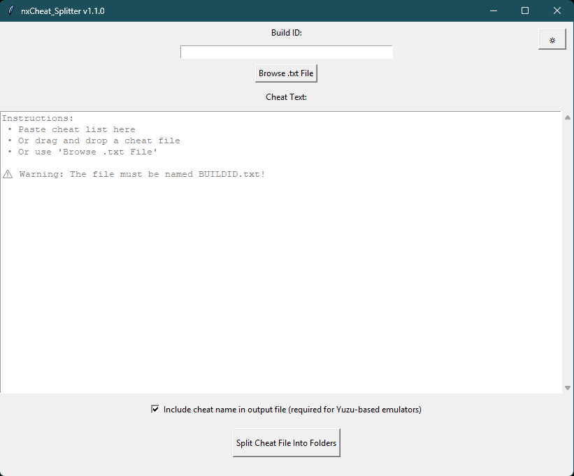
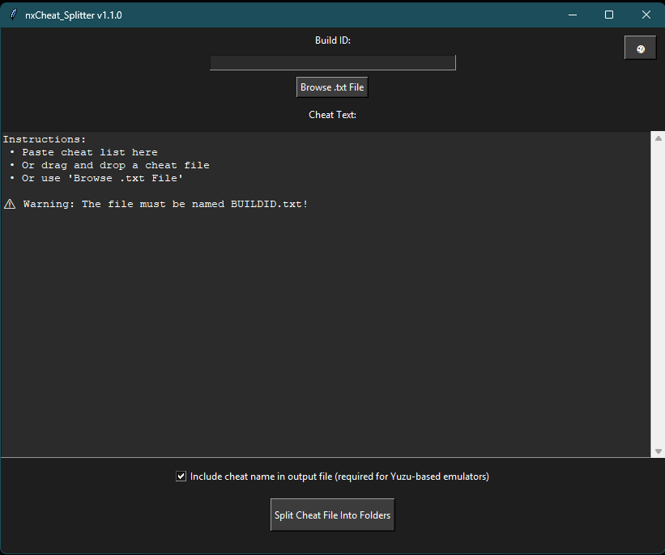
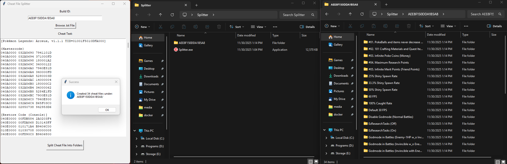

# Cheat File Splitter


A simple Windows tool to split Nintendo Switch cheat files into per-build-ID folders.  
Compatible with Eden Emulator and similar emulators that require cheats in individual folders . 
Supports drag-and-drop, dark mode, and Windows 10 & 11.

---

## Table of Contents

- [Features](#features)  
- [Requirements](#requirements)  
- [Installation](#installation)  
  - [Python Version](#python-version)  
  - [Pip Install Option](#pip-install-option)  
  - [Executable Version](#executable-version)  
- [Usage](#usage)  
- [Screenshots](#screenshots)  
- [Example](#example)  
- [Contributing](#contributing)  
- [Disclaimer](#disclaimer)  

---

## Features

- ✅ Drag-and-drop `.txt` cheat files  
- ✅ Auto-detect Build ID from filename  
- ✅ Generates separate folders per Build ID to prevent mix-ups  
- ✅ Light/Dark mode toggle  
- ✅ Windows 10 & 11 compatible  

---

### Requirements

- Python 3.10+  
- `tkinter` (built-in with Python)  
- Optional for drag-and-drop:  
  ```
  pip install tkinterdnd2
  ```

> **Note:** Both `.py` and `.pyw` versions use the same dependencies.
>
> * `.py` shows a console window alongside the GUI.
> * `.pyw` runs the GUI without a console window.

---

### Installation

#### Python Version

1. Clone or download the repository:

   ```
   git clone https://github.com/Ninjistix/nxCheat_Splitter.git
   ```
2. Navigate to the project folder:

   ```bash
   cd nxCheat_Splitter
   ```
3. Install dependencies:

   ```bash
   pip install -r requirements.txt
   ```
4. Run the program:

* **Python GUI with console (`.py`)**

  ```
  python src/cheat_converter_gui.py
  ```

* **Python GUI without console (`.pyw`)**

  ```
  pythonw src/cheat_converter_gui.pyw
  ```

#### Pip Install Option

Install as a Python package and use the command line:

```bash
pip install .
nxcheat
```

This launches the GUI directly.

#### Executable Version

1. Download `Splitter.exe` from the Releases page.
2. Double-click to run — no Python installation required.

---

### Usage

1. Ensure your cheat file is named `BUILDID.txt`, e.g., `421C5411B487EB4D.txt`.
2. Open the program (Python, `.pyw`, or exe version).
3. Paste cheats into the text box **or** drag-and-drop a `.txt` file **or** use `Browse .txt File`.
4. Enter the Build ID manually if it is not automatically detected.
5. Click **Split Cheat File Into Folders**.

> **Note:** The output folders will be created **next to the location** of the `.py`, `.pyw`, or `.exe` file.

Output folders will have this structure:

```
BUILDID/
  CheatName/
    cheats/
      BUILDID.txt
```

---

### Screenshots

**Light & Dark Mode**

<table>
<tr>
<td></td>
<td></td>
</tr>
<tr>
<td align="center">Light Mode</td>
<td align="center">Dark Mode</td>
</tr>
</table>

**Full Workflow (Input → Output → Subfolders)**



*Screenshot shows the program GUI with cheats input (left), the main output folder for the Build ID (middle), and the subfolders for individual cheats (right/bottom).*

---

### Example

Input file `421C5411B487EB4D.txt`:

```
[4x Shiny Chance]
04000000 00DEF438 11000508
04000000 00DEF448 531E7515
040000
```

---

### Contributing

Contributions are welcome! You can help by:

* Forking the repository and creating a feature branch
* Submitting pull requests with bug fixes or improvements
* Reporting issues on GitHub

Please make sure your code follows the existing style and works on Windows 10/11.

---

### Disclaimer

This program is provided "as-is" and comes with **no warranty**.
The author does not offer support for any issues.

You are welcome to fork the repository, make modifications, and submit pull requests.
